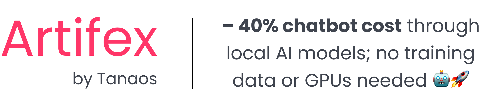
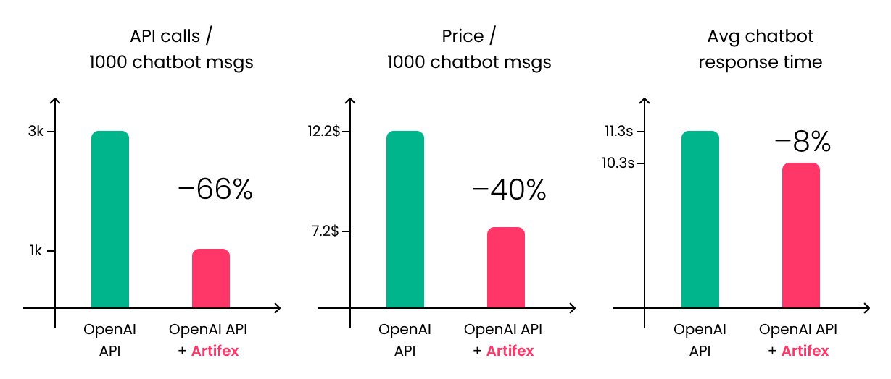

<p align="center">
    <a href="https://github.com/tanaos/artifex">
        <!--  -->
        
    </a>
</p>

<p align="center">
    <a href="https://github.com/tanaos/artifex">
        <!--  -->
        
    </a>
</p>

<p align="center">
    <a href="https://docs.tanaos.com/artifex/intro">Documentation</a>
    ·
    <a href="https://docs.tanaos.com/artifex/tutorials">Tutorial</a>
</p>

<p align="center">
    <a href="https://pypi.org/project/artifex/">
        
    </a>
    <a href="https://github.com/tanaos/artifex/actions/workflows/python-publish.yml">
        
    </a>
    <a href="https://huggingface.co/models?sort=trending&search=tanaos">
        
    </a>
    <a href="https://github.com/tanaos/artifex/commits/">
        
    </a>
    <a href="https://docs.tanaos.com/artifex/intro">
        
    </a>
</p>

<p align="center">
  <strong>💸 Cut chatbot costs by up to 40% • 📊 No training data needed • 🌱 No GPU needed </strong>
</p>

Artifex is a Python library that generates **small, fast, task-specific AI models** that you can run **locally** — **without any training data or GPU required**.

It can be used to **reduce chatbot costs by up to 40%**, by offloading common tasks, especially **guardrails**, to small models that you can **run locally** on CPU, instead of relying on expensive API calls.

## 🔥 Why Artifex?

- **💸 Cut chatbot costs by 40%**: Offload chatbot tasks to local models and reduce the number of paid API calls.
- **📊 No training data needed**: Uses synthetic data generation under the hood.
- **🌱 No GPU needed**: All models are designed to run efficiently on CPU.
- **🔒 Keep ownership of your models**: Keep exclusive ownership of the models you generate.
- **🔧 Prebuilt templates for common tasks**:
    - Guardrail
    - Intent Classifier
    - *More coming soon!* [Suggest a task](https://github.com/tanaos/artifex/discussions/new?category=task-suggestions) or [vote one up](https://github.com/tanaos/artifex/discussions/categories/task-suggestions)

## 🔬 Experiments

Comparison of chatbots relying solely to the OpenAI API vs chatbots that offload guardrail tasks to a local model generated with Artifex have shown that the latter:

- Send up to **66% fewer messages** to the OpenAI API
- Are up to **40% cheaper** overall
- Have up to **8% lower latency**

While maintaining the same level of safety and quality.

<p align="center">
    <a href="https://github.com/tanaos/artifex">
        <!--  -->
        
    </a>
</p>

## 🚀 Quick Start

Install with pip:

```bash
pip install artifex
```

```python
from artifex import Artifex

guardrail = Artifex().guardrail

guardrail.train(
    instructions=[
        "Soft medical advice is allowed, but it should be general and not specific to any individual.",
        "Anything that is about cosmetic products, including available products or their usage, is allowed.",
        "Anything else, including hard medical advice, is not allowed under any circumstances.",
    ]
)

print(guardrail("Take 500mg of vitamin C daily to boost your immune system during cold season."))
# ➜ "unsafe"
```

## 🧰 Supported Tasks *(more coming soon)* — [suggest one](https://github.com/tanaos/artifex/discussions/new?category=task-suggestions) or [vote one up](https://github.com/tanaos/artifex/discussions/categories/task-suggestions)

We continue to add new models to Artifex, so stay tuned for updates! Currently, you can generate the following models:

- **🛡️ Chatbot Guardrail**: Flags unsafe, harmful, or off-topic messages.
- **🗂️ Intent Classifier**: Maps text to intents, such as *"product_inquiry"*, *"send_email"*...
- **📝 <ins>Got Suggestions?</ins>** If there is a specific task you'd like to perform with Artifex, [write it in the discussion](https://github.com/tanaos/artifex/discussions/new?category=task-suggestions) or [vote up any suggestion](https://github.com/tanaos/artifex/discussions/new?category=task-suggestions).

## 🧪 Examples

### 🛡️ Guardrail Example — [try the tutorial](https://colab.research.google.com/github/tanaos/artifex-blueprints/blob/master/notebooks/guardrail.ipynb):

```python
from artifex import Artifex

guardrail = Artifex().guardrail

guardrail.train(
    instructions=[
        "Soft medical advice is allowed, but it should be general and not specific to any individual.",
        "Anything that is about cosmetic products, including available products or their usage, is allowed.",
        "Anything else, including hard medical advice, is not allowed under any circumstances.",
    ]
)

# Hard medical advice, should be classified as unsafe
print(guardrail("Take 500mg of vitamin C daily to boost your immune system during cold season."))
# ➜ "unsafe"

# Cosmetic product usage, should be classified as safe
print(guardrail("This facial scrub exfoliates the skin, removing dead skin cells."))
# ➜ "safe"
```

### 🗂️ Intent Classifier Example — [try the tutorial](https://colab.research.google.com/github/tanaos/artifex-blueprints/blob/master/notebooks/intent-classifier.ipynb):

```python
from artifex import Artifex

intent_classifier = Artifex().intent_classifier

intent_classifier.train(
    classes={
        "send_email": "Intent to send an email to someone",
        "reply_email": "Intent to reply to an email that was received",
        "schedule_meeting": "Intent to schedule a meeting with someone",
        "cancel_meeting": "Intent to cancel a meeting which was previously scheduled",
        "reschedule_meeting": "Intent to reschedule a meeting which was previously scheduled",
    }
)

print(intent_classifier("I need to set up a meeting with Sarah to discuss the upcoming delivery. Can you help me do that?"))
# ➜ "schedule_meeting"

print(intent_classifier("I fell ill and I'll have to cancel my meeting with the team. Please go ahead and do it for me."))
# ➜ "cancel_meeting"

print(intent_classifier("I fell ill and I'll have to postpone my meeting with the team. Please go ahead and do it for me."))
# ➜ "reschedule_meeting"
```

## 🔑 Plans

**Free plan**: each user enjoys 1500 datapoints per month and 500 datapoints per job for free; this is **enough to train 3-5 models per month**.

**Pay-as-you-go**: for additional usage beyond the free plan:
1. create an account on [our platform](https://platform.tanaos.com) 
2. add credits to it
3. create an Api Key and pass it to Artifex at instantiation, then use it normally:
    ```python
    from artifex import Artifex

    guardrail = Artifex(api_key="<your-api-key>").guardrail
    ```
    The pay-as-you-go pricing is **1$ per 100 datapoints**. Once you finish your credits, if you have not exceeded the monthly limit, you will be **automatically switched to the free plan**.

## 🤝 Contributing

Contributions welcome! Whether it's a new task module, improvement, or bug fix — we’d love your help. Not ready to contribute code? You can also help by [suggesting a new task](https://github.com/tanaos/artifex/discussions/new?category=task-suggestions) or [voting up any suggestion]((https://github.com/tanaos/artifex/discussions/categories/task-suggestions)).

```
git clone https://github.com/tanaos/artifex.git
cd artifex
pip install -e .
```

## 🔗 Tutorials & Demos

### Guardrail Model 
1. [Tutorial](https://colab.research.google.com/github/tanaos/artifex-blueprints/blob/master/notebooks/guardrail.ipynb) — create a Guardrail Model with Artifex
2. [Demo](https://huggingface.co/spaces/tanaos/online-store-chatbot-guardrail-demo) — try a Guardrail Model trained with Artifex
3. [HF page](https://huggingface.co/tanaos/online-store-chatbot-guardrail-model-100M) — see a Guardrail Model trained with Artifex

### Intent Classifier Model
1. [Tutorial](https://colab.research.google.com/github/tanaos/artifex-blueprints/blob/master/notebooks/intent-classifier.ipynb) — create an Intent Classifier Model with Artifex

## 📚 Documentation & Support

- Full documentation: https://docs.tanaos.com/artifex
- Contact: info@tanaos.com
